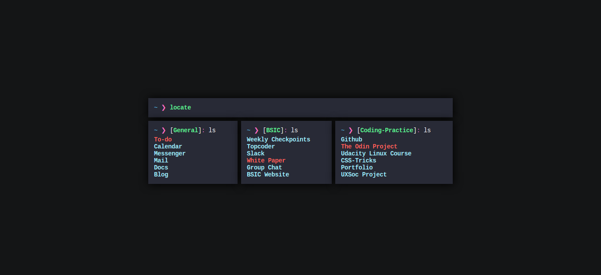

My terminal-inspired firefox homepage.

[Live demo](https://aadilayub.github.io/Start-Page/) 

# Things to add: 

1. Second row of boxes
2. Remove search bar
3. Display the day's Todoist tasks
4. Add alto box
5. Show how much % of the day is done
